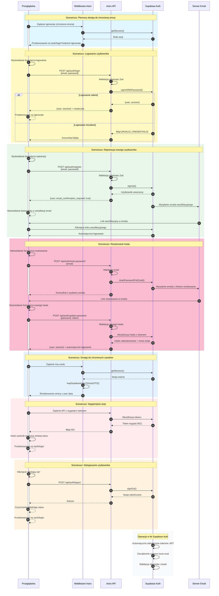

```mermaid
sequenceDiagram
    autonumber

    participant Browser as Przeglądarka
    participant Middleware as Middleware Astro
    participant API as Astro API
    participant Supabase as Supabase Auth
    participant Email as Serwer Email

    %% Scenariusz 1: Pierwszy dostęp do chronionej strony
    rect rgb(225, 245, 254)
        Note over Browser,Supabase: Scenariusz: Pierwszy dostęp do chronionej strony
        Browser->>Middleware: Żądanie /generate (chroniona strona)
        activate Browser
        Middleware->>Supabase: getSession()
        Supabase-->>Middleware: Brak sesji
        Middleware-->>Browser: Przekierowanie na /auth/login?redirect=/generate
        deactivate Browser
    end

    %% Scenariusz 2: Proces logowania
    rect rgb(255, 249, 196)
        Note over Browser,Supabase: Scenariusz: Logowanie użytkownika
        Browser->>Browser: Wyświetlanie formularza logowania
        Browser->>API: POST /api/auth/login<br/>{email, password}
        activate Browser
        API->>API: Walidacja schematu Zod
        API->>Supabase: signInWithPassword()
        alt Logowanie udane
            Supabase-->>API: {user, session}
            API-->>Browser: {user, session} + ciasteczka
            Browser-->>Browser: Przekierowanie na /generate
        else Logowanie nieudane
            Supabase-->>API: Błąd (INVALID_CREDENTIALS)
            API-->>Browser: Komunikat błędu
        end
        deactivate Browser
    end

    %% Scenariusz 3: Rejestracja nowego użytkownika
    rect rgb(232, 245, 233)
        Note over Browser,Email: Scenariusz: Rejestracja nowego użytkownika
        Browser->>Browser: Wyświetlanie formularza rejestracji
        Browser->>API: POST /api/auth/register<br/>{email, password}
        activate Browser
        API->>API: Walidacja schematu Zod
        API->>Supabase: signUp()
        Supabase-->>API: Użytkownik utworzony
        API-->>Browser: {user, email_confirmation_required: true}
        Supabase->>Email: Wysyłanie emaila weryfikacyjnego
        Browser-->>Browser: Wyświetlanie komunikatu o weryfikacji email
        deactivate Browser

        Email->>Browser: Link weryfikacyjny w emailu
        Browser->>Supabase: Kliknięcie linku weryfikacyjnego
        Supabase-->>Browser: Automatyczne logowanie
    end

    %% Scenariusz 4: Resetowanie hasła
    rect rgb(248, 187, 208)
        Note over Browser,Email: Scenariusz: Resetowanie hasła
        Browser->>Browser: Wyświetlanie formularza resetowania
        Browser->>API: POST /api/auth/reset-password<br/>{email}
        activate Browser
        API->>API: Walidacja email
        API->>Supabase: resetPasswordForEmail()
        Supabase->>Email: Wysyłanie emaila z linkiem resetowania
        API-->>Browser: Komunikat o wysłaniu emaila
        deactivate Browser

        Email->>Browser: Link resetowania w emailu
        Browser->>Browser: Wyświetlanie formularza nowego hasła
        Browser->>API: POST /api/auth/update-password<br/>{password, token}
        activate Browser
        API->>API: Walidacja nowego hasła
        API->>Supabase: Aktualizacja hasła z tokenem
        Supabase-->>API: Hasło zaktualizowane + nowa sesja
        API-->>Browser: {user, session} + automatyczne logowanie
        deactivate Browser
    end

    %% Scenariusz 5: Dostęp do chronionej strony po zalogowaniu
    rect rgb(227, 242, 253)
        Note over Browser,Supabase: Scenariusz: Dostęp do chronionych zasobów
        Browser->>Middleware: Żądanie /my-cards
        activate Browser
        Middleware->>Supabase: getSession()
        Supabase-->>Middleware: Sesja ważna
        Middleware->>Middleware: mapSupabaseUserToUserDTO()
        Middleware-->>Browser: Renderowanie strony z user data
        deactivate Browser
    end

    %% Scenariusz 6: Wygaśnięcie sesji
    rect rgb(255, 235, 238)
        Note over Browser,Supabase: Scenariusz: Wygaśnięcie sesji
        Browser->>API: Żądanie API z wygasłym tokenem
        activate Browser
        API->>Supabase: Weryfikacja tokenu
        Supabase-->>API: Token wygasł (401)
        API-->>Browser: Błąd 401
        Browser->>Browser: Hook useAuth wykrywa zmianę stanu
        Browser-->>Browser: Przekierowanie na /auth/login
        deactivate Browser
    end

    %% Scenariusz 7: Wylogowanie
    rect rgb(255, 243, 224)
        Note over Browser,Supabase: Scenariusz: Wylogowanie użytkownika
        Browser->>Browser: Kliknięcie "Wyloguj się"
        Browser->>API: POST /api/auth/logout
        activate Browser
        API->>Supabase: signOut()
        Supabase-->>API: Sesja zakończona
        API-->>Browser: Sukces
        Browser-->>Browser: Czyszczenie lokalnego stanu
        Browser-->>Browser: Przekierowanie na /auth/login
        deactivate Browser
    end

    %% Dodatkowe interakcje w tle
    rect rgb(248, 250, 252)
        Note over Supabase: Operacje w tle Supabase Auth
        Supabase->>Supabase: Automatyczne odświeżanie tokenów JWT
        Supabase->>Supabase: Zarządzanie czasem życia sesji
        Supabase->>Supabase: Walidacja siły hasła i emaili
    end
```
