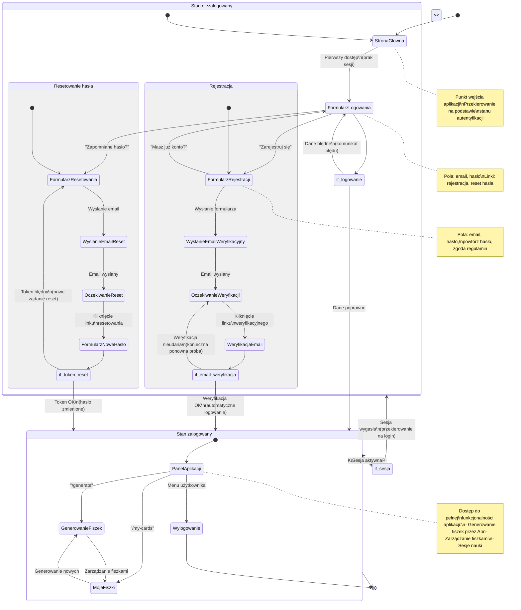

# Diagram podróży użytkownika - Moduł autentyfikacji 10x-cards

## Analiza podróży użytkownika dla modułu autentyfikacji 10x-cards

### Główne ścieżki użytkownika

1. **Pierwszy dostęp niezalogowanego użytkownika**
   - Użytkownik wchodzi na dowolną chronioną stronę
   - Middleware sprawdza sesję i przekierowuje na `/auth/login?redirect=/current-path`
   - Użytkownik widzi stronę logowania z opcjami rejestracji i resetowania hasła

2. **Rejestracja nowego użytkownika**
   - Użytkownik klika "Zarejestruj się" na stronie logowania
   - Wypełnia formularz rejestracji (email, hasło, powtórz hasło, zgoda regulamin)
   - Po wysłaniu formularza Supabase wysyła email weryfikacyjny
   - Użytkownik klika link weryfikacyjny w emailu
   - Po weryfikacji zostaje automatycznie zalogowany i przekierowany

3. **Logowanie istniejącego użytkownika**
   - Użytkownik wprowadza email i hasło
   - Po poprawnym logowaniu zostaje przekierowany na pierwotną stronę lub `/generate`
   - W przypadku błędnych danych wyświetla się komunikat błędu

4. **Resetowanie hasła**
   - Użytkownik klika "Zapomniane hasło?" na stronie logowania
   - Wprowadza email i wysyła żądanie
   - Supabase wysyła email z linkiem resetowania
   - Użytkownik klika link i zostaje przekierowany na stronę nowego hasła
   - Po zmianie hasła zostaje automatycznie zalogowany

5. **Automatyczne wylogowanie**
   - Sesja wygasa (token JWT wygaśnięty)
   - Następne żądanie API zwraca błąd 401
   - Hook useAuth wykrywa brak sesji i przekierowuje na logowanie

6. **Korzystanie z aplikacji (zalogowany użytkownik)**
   - Dostęp do `/generate` - generowanie fiszek przez AI
   - Dostęp do `/my-cards` - zarządzanie fiszkami (tworzenie, edycja, usuwanie)
   - Możliwość wylogowania przez menu użytkownika

### Punkty decyzyjne i alternatywne ścieżki

1. **Czy użytkownik jest zalogowany?**
   - Tak: dostęp do chronionych stron
   - Nie: przekierowanie na logowanie

2. **Czy użytkownik ma konto?**
   - Tak: ścieżka logowania
   - Nie: ścieżka rejestracji

3. **Czy dane logowania są poprawne?**
   - Tak: pomyślne logowanie
   - Nie: komunikat błędu, możliwość ponownej próby

4. **Czy email rejestracji jest dostępny?**
   - Tak: rejestracja kontynuowana
   - Nie: komunikat o istniejącym koncie

5. **Czy weryfikacja email powiodła się?**
   - Tak: automatyczne logowanie
   - Nie: komunikat o konieczności weryfikacji

6. **Czy token resetowania jest prawidłowy?**
   - Tak: możliwość ustawienia nowego hasła
   - Nie: komunikat błędu, konieczność nowego żądania

7. **Czy sesja wygasła?**
   - Tak: automatyczne wylogowanie i przekierowanie
   - Nie: kontynuacja sesji

### Stany główne i ich cele

- **Strona główna**: Punkt wejścia, przekierowanie na podstawie stanu autentyfikacji
- **Formularz logowania**: Uwierzytelnienie istniejącego użytkownika
- **Formularz rejestracji**: Tworzenie nowego konta użytkownika
- **Weryfikacja email**: Potwierdzenie własności adresu email
- **Formularz resetowania**: Żądanie resetowania hasła
- **Ustawianie nowego hasła**: Zmiana hasła z tokenem resetowania
- **Panel aplikacji**: Główna funkcjonalność (generowanie, zarządzanie fiszkami)
- **Stan wylogowania**: Koniec sesji, konieczność ponownego logowania

### Biznesowe punkty decyzyjne

- **Weryfikacja email**: Wymagana dla bezpieczeństwa i zapobiegania spamowi
- **Bezpieczne przechowywanie sesji**: JWT tokens z automatycznym odświeżaniem
- **Ochrona przed atakami**: Rate limiting, walidacja danych wejściowych
- **RODO compliance**: Możliwość usunięcia konta, eksport danych

## Diagram Mermaid

---

**Data utworzenia**: $(date)  
**Wersja**: 1.0  
**Autor**: AI Assistant  
**Źródła**: prd.md, auth-spec.md</contents>

