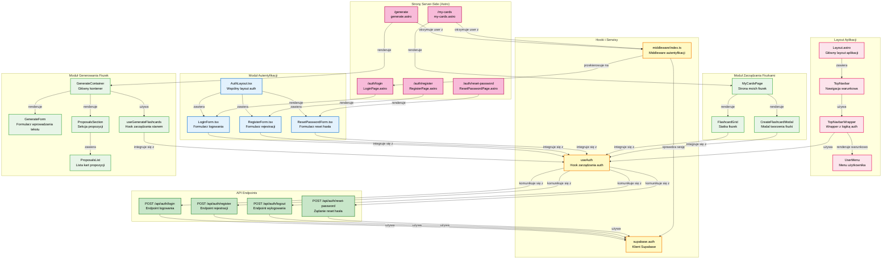

```mermaid
flowchart TD
    %% Layout i nawigacja
    subgraph "Layout Aplikacji"
        A["Layout.astro<br/>Główny layout aplikacji"]
        B["TopNavbar<br/>Nawigacja warunkowa"]
        C["TopNavbarWrapper<br/>Wrapper z logiką auth"]
        D["UserMenu<br/>Menu użytkownika"]
    end

    %% Moduł autentyfikacji
    subgraph "Moduł Autentyfikacji"
        E["AuthLayout.tsx<br/>Wspólny layout auth"]
        F["LoginForm.tsx<br/>Formularz logowania"]
        G["RegisterForm.tsx<br/>Formularz rejestracji"]
        H["ResetPasswordForm.tsx<br/>Formularz reset hasła"]
    end

    %% Strony Astro - Server Side
    subgraph "Strony Server-Side (Astro)"
        I["/auth/login<br/>LoginPage.astro"]
        J["/auth/register<br/>RegisterPage.astro"]
        K["/auth/reset-password<br/>ResetPasswordPage.astro"]
        L["/generate<br/>generate.astro"]
        M["/my-cards<br/>my-cards.astro"]
    end

    %% API Endpoints
    subgraph "API Endpoints"
        N["POST /api/auth/login<br/>Endpoint logowania"]
        O["POST /api/auth/register<br/>Endpoint rejestracji"]
        P["POST /api/auth/logout<br/>Endpoint wylogowania"]
        Q["POST /api/auth/reset-password<br/>Żądanie reset hasła"]
    end

    %% Hooki i serwisy
    subgraph "Hooki i Serwisy"
        R["useAuth<br/>Hook zarządzania auth"]
        S["supabase.auth<br/>Klient Supabase"]
        T["middleware/index.ts<br/>Middleware autentyfikacji"]
    end

    %% Moduł generowania fiszek
    subgraph "Moduł Generowania Fiszek"
        U["GenerateContainer<br/>Główny kontener"]
        V["GenerateForm<br/>Formularz wprowadzania tekstu"]
        W["ProposalsSection<br/>Sekcja propozycji"]
        X["ProposalsList<br/>Lista kart propozycji"]
        Y["useGenerateFlashcards<br/>Hook zarządzania stanem"]
    end

    %% Moduł zarządzania fiszkami
    subgraph "Moduł Zarządzania Fiszkami"
        Z["MyCardsPage<br/>Strona moich fiszek"]
        AA["FlashcardGrid<br/>Siatka fiszek"]
        BB["CreateFlashcardModal<br/>Modal tworzenia fiszki"]
    end

    %% Przepływy danych i integracje
    A -->|"zawiera"| B
    B -->|"używa"| C
    C -->|"używa"| R
    C -->|"renderuje warunkowo"| D

    E -->|"zawiera"| F
    E -->|"zawiera"| G
    E -->|"zawiera"| H

    I -->|"renderuje"| F
    J -->|"renderuje"| G
    K -->|"renderuje"| H

    L -->|"renderuje"| U
    M -->|"renderuje"| Z

    F -->|"integruje się z"| R
    G -->|"integruje się z"| R
    H -->|"integruje się z"| R

    R -->|"komunikuje się z"| N
    R -->|"komunikuje się z"| O
    R -->|"komunikuje się z"| P
    R -->|"komunikuje się z"| Q

    N -->|"używa"| S
    O -->|"używa"| S
    P -->|"używa"| S
    Q -->|"używa"| S

    T -->|"sprawdza sesję"| S
    T -->|"przekierowuje na"| I

    L -->|"otrzymuje user z"| T
    M -->|"otrzymuje user z"| T

    U -->|"używa"| Y
    Y -->|"integruje się z"| R

    W -->|"zawiera"| X
    U -->|"renderuje"| V
    U -->|"renderuje"| W

    Z -->|"renderuje"| AA
    Z -->|"renderuje"| BB

    AA -->|"integruje się z"| R
    BB -->|"integruje się z"| R

    %% Style dla węzłów z lepszym kontrastem
    classDef authNode fill:#e3f2fd,stroke:#1976d2,stroke-width:2px,color:#000000
    classDef pageNode fill:#f8bbd9,stroke:#c2185b,stroke-width:2px,color:#000000
    classDef apiNode fill:#c8e6c9,stroke:#388e3c,stroke-width:2px,color:#000000
    classDef hookNode fill:#fff9c4,stroke:#f57c00,stroke-width:2px,color:#000000
    classDef layoutNode fill:#fce4ec,stroke:#e91e63,stroke-width:2px,color:#000000
    classDef featureNode fill:#e8f5e8,stroke:#4caf50,stroke-width:2px,color:#000000

    class E,F,G,H authNode
    class I,J,K,L,M pageNode
    class N,O,P,Q apiNode
    class R,S,T hookNode
    class A,B,C,D layoutNode
    class U,V,W,X,Y,Z,AA,BB featureNode
```
